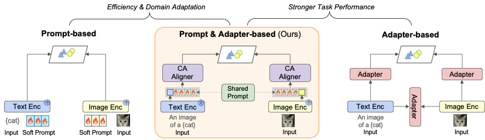

# SPANER: Shared Prompt Aligner for Multimodal Semantic Representation
Implementation of [SPANER: Shared Prompt Aligner for Multimodal Semantic Representation](https://arxiv.org/abs/2508.13387)

<div align="center">
      <p>
        <strong>Thye Shan Ng</strong>,
        <strong>Soyeon Caren Han</strong>
        <strong>Eun-Jung Holden</strong>
      </p>
</div>

<div align="center">
    <p>The University of Melbourne</p>
</div>

<p align="center"></p>

## Updates
- 🎉 The code will be open-sourced very soon


## Abstract
Recent advances in multimodal Parameter-Efficient Fine-Tuning (PEFT) have significantly improved performance on downstream tasks such as few-shot retrieval. However, most existing approaches focus on task-specific gains while neglecting the structure of the multimodal embedding space. As a result, modality-specific representations often remain isolated, limiting cross-modal generalisation. In this work, we introduce Shared Prompt AligNER (SPANER), a modality-agnostic PEFT framework designed to embed inputs from diverse modalities into a unified semantic space. At its core, SPANER employs a shared prompt mechanism that acts as a conceptual anchor, enabling semantically related instances to converge spatially regardless of modality. This shared prompt design is inherently extensible, supporting the seamless integration of additional modalities, such as audio, without altering the core architecture. Through comprehensive experiments across vision-language and audio-visual benchmarks, SPANER demonstrates competitive few-shot retrieval performance
while preserving high semantic coherence in the learned embedding space. Our results highlight the importance of aligning embedding structures, rather than merely tuning adapter weights, for scalable multimodal learning.


------


If you find our method useful, please kindly cite our paper.
```bibtex
@misc{ng2025spanersharedpromptaligner,
      title={SPANER: Shared Prompt Aligner for Multimodal Semantic Representation}, 
      author={Thye Shan Ng and Caren Soyeon Han and Eun-Jung Holden},
      year={2025},
      eprint={2508.13387},
      archivePrefix={arXiv},
      primaryClass={cs.AI},
      url={https://arxiv.org/abs/2508.13387}, 
}

```

## 4. Contributing
We welcome contributions from the research community to improve the efficiency of SPANER. If you have any idea or would like to report a bug, please open an issue or submit a pull request.

## 5. License
The code is released under the MIT License.

